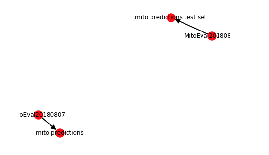

# DatasetDatabase
Scientific modeling efforts increasingly produce intermediate versions of datasets, e.g. analysis results, model predictions, training weights for neural nets, etc. In many cases there is no clearly defined final version of the dataset that becomes canonical. As these efforts frequently are intertwined, there is an implicit dependency graph of what version of all prior datasets a given output is produced from. To be able to examine the prior versions of any dataset and track its dependencies we've created a database to track and deduplicate datasets.

Dataset Database (dsdb) is a python package for handling arbitrary datasets (or general python objects) with little to no similarity between any given one. It provides mechanisms for versioning, deduplicating, validation, and tracking datasets as they are ingested, processed, or created.

## Install
`pip install git+https://github.com/AllenCellModeling/datasetdatabase.git`

## Documentation
[https://allencellmodeling.gitbook.io/datasetdatabase/](https://allencellmodeling.gitbook.io/datasetdatabase/)

***Full Versioning, Deduplication, Validation, and Tracking of Arbitrary Datasets***

---

The quick start guide can be found [here](./docs/quickstart.md).

There are three core functions for using a dataset database:

1. [Ingest](./docs/ingest.md)
2. [Process](./docs/process.md)
3. [Share](./docs/share.md)

Details of implementation and package design are split into:

* [Database Schemas](./docs/schema.md)
* [Database Constructor](./docs/constructor.md)
* [File Management Systems](./docs/fms.md)
* [Processing and Algorithm Handling](./docs/run.md)

This is an open source project created at the Allen Institute for Cell Science and contributions are welcome. Please refer to the [AllenCellModeling GitHub](https://github.com/allencellmodeling) for contributing, bug reports, and feature requests.

## Contact
Jackson Maxfield Brown

jacksonb@alleninstitute.org

## License
`DatasetDatabase` is licensed under the terms of the BSD-2 license. See the file
"LICENSE" for information on the history of this software, terms & conditions
for usage, and a DISCLAIMER OF ALL WARRANTIES.

All trademarks referenced herein are property of their respective holders.
Copyright (c) 2018--, Jackson Maxfield Brown, The Allen Institute for Cell
Science.
